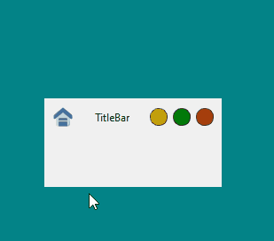
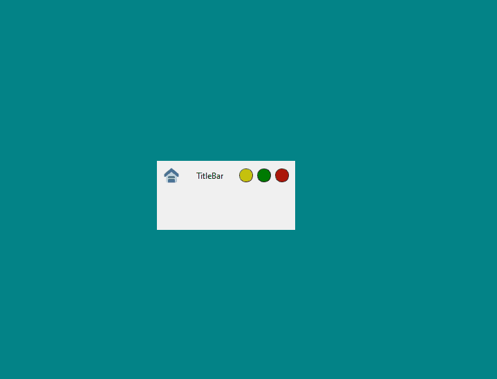
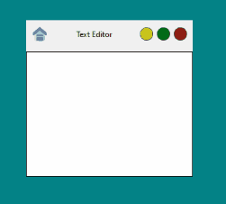

# QtFrameless


--------------------------

## Overview

A PySide6 Implementation of a draggable, resizable, and frameless QMainWindow widget.
It comes with a built in title bar with standard close, maximize and minimize buttons,
however it users can also provide their own Titlebar QWidget subclass.

__This project is very young, far from stable, and filled with bugs.  _Use at your own peril.___

## Features

-   Frameless
-   Custom Title Bar
-   Resizeable
-   Draggable
-   Pluggable
-   Extensible

## Install

Using PyPi

```
pip install QtFrameless
```

Using git

```
git clone https://github.com/alexpdev/QtFrameless.git
cd QtFrameless
pip install .
```

## Examples

The simplest possible example:

```python3
from PySide6.QtWidgets import QApplication
from QtFrameless import FramelessWindow

app = QApplication([])
FramelessWindow().show()
app.exec()
```



----------------------------

Another simple `Hello World` example that uses subclassing and changes 
the window title.

```python3
from PySide6.QtWidgets import QApplication
from QtFrameless import FramelessWindow

class MainWindow(FramelessWindow):
    def __init__(self):
        super().__init__()
        self.setWindowTitle("HELLO WORLD!")
```



----------------------------


Example that creates a `QTextEdit` widget as the central widget.

```python3
from PySide6.QtWidgets import QApplication, QTextEdit
from QtFrameless import FramelessWindow

class MainWindow(FramelessWindow):
    def __init__(self):
        super().__init__()
        self.setWindowTitle("Text Editor")
        self.textEdit = QTextEdit(parent=self)
        self.setCentralWidget(self.textEdit)
        self.setStyleSheet("QTextEdit {border: 1px solid black;}")
```



----------------------------

An example of providing a custom widget class to use as the title bar.

```python3
from PySide6.QtWidgets import *
from QtFrameless import FramelessWindow

class TitleBar(QWidget):
    def __init__(self, parent=None):
        super().__init__(parent=parent)
        self.layout = QHBoxLayout(self)
        self.setup_menubar()
        self.button = QPushButton("CLOSE", self)
        self.button.clicked.connect(app.exit)
        self.layout.addWidget(self.menu_bar)
        self.layout.addWidget(self.button)
        self.setMaximumHeight(50)

    def setup_menubar(self):
        self.menu_bar = QMenuBar()
        self.file_menu = QMenu("File")
        self.options_menu = QMenu("Options")
        self.edit_menu = QMenu("Edit")
        self.menu_bar.addMenu(self.options_menu)
        self.menu_bar.addMenu(self.file_menu)
        self.menu_bar.addMenu(self.edit_menu)
        self.save_action = QAction("Save")
        self.exit_action = QAction("Exit")
        self.about_action = QAction("About")
        self.copy_action = QAction("Copy")
        self.paste_action = QAction("Paste")
        self.cut_action = QAction("Cut")
        self.file_menu.addActions([self.save_action, self.exit_action])
        self.edit_menu.addActions(
            [self.copy_action, self.cut_action, self.paste_action])
        self.options_menu.addAction(self.about_action)

if "main" in __name__:
    app = QApplication([])
    window = FramelessWindow(titleBar=TitleBar)
    window.show()
    app.exec()
```


